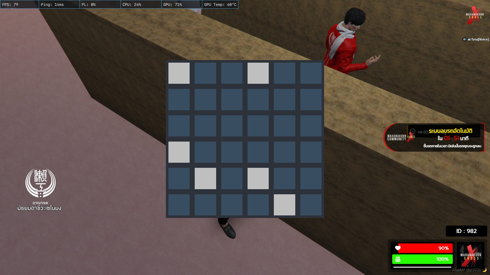

# FiveM Memory Minigame Bot

> An AutoHotkey script that automatically plays the "Simon Says" memory minigame in FiveM


## What does this do?

This script plays a **memory minigame** for you in FiveM. Here's how the minigame works:

1. **Memorize Phase**: Some squares on a 6×6 grid turn **gray/white**
2. **Repeat Phase**: You must click those same squares in the same order
3. **The script**: Automatically detects the gray squares and clicks them for yo

## Requirements

- **AutoHotkey v1.1** (not v2.0) - [Download here](https://www.autohotkey.com/download/1.1/AutoHotkey_1.1.37.01_setup.exe)
- Windows PC
- FiveM running in **windowed or borderless window** mode

## Setup

### 1. Install AutoHotkey
Download and install AutoHotkey version 1.1 from the link above.

### 2. Configure Screen Position
The script needs to know **exactly** where your minigame appears on screen.

Open the `.ahk` file and look for this line near the top:
```autohotkey
containerX := 650, containerY := 236, squareWidth := 83, squareHeight := 83
```

**You MUST change these numbers** to match your screen. Here's how:

| Setting | What it means |
|---------|---------------|
| `containerX` | Distance from the **left** of your screen to the minigame |
| `containerY` | Distance from the **top** of your screen to the minigame |
| `squareWidth` | Width of one square (usually 83) |
| `squareHeight` | Height of one square (usually 83) |

**Quick way to find coordinates:**
1. Press `Print Screen` when the minigame is visible
2. Paste into Paint
3. Hover your mouse over the **top-left corner** of the first square
4. Look at the bottom-left of Paint - those are your X, Y coordinates

### 3. Save and Run
- Save the file with `.ahk` extension (e.g., `minigame_bot.ahk`)
- Double-click the file to run it
- You should see the AutoHotkey icon in your system tray

## Controls

| Hotkey | Action |
|--------|--------|
| `Ctrl + F11` | **Turn the bot ON/OFF** (main toggle) |
| `Ctrl + F12` | Show/hide green boxes around detection areas (for debugging) |
| `Ctrl + F10` | Reload the script (if something breaks) |
| `Ctrl + F9` | Pause/Unpause the script |
| `ESC` | Close the script completely |

## How to Use

1. **Start the script** (double-click the `.ahk` file)
2. **Stand near the minigame** in FiveM so it's visible on screen
3. **Press `Ctrl + F11`** to turn the bot ON
4. **Start the minigame** in-game
5. The script will:
   - Watch for gray squares appearing
   - Remember their positions
   - Click them automatically when it's your turn
6. **Press `Ctrl + F11`** again to turn it OFF when done

## Troubleshooting

### "It's not clicking anything!"
- **Check coordinates**: The most common issue. Use `Ctrl + F12` to see green boxes. They should perfectly outline each square of the minigame.
- **Window mode**: Make sure FiveM is in windowed or borderless mode, not fullscreen
- **Resolution**: If you change screen resolution, you must update the coordinates

### "It's clicking the wrong squares"
- The minigame might have moved. Recalibrate your `containerX` and `containerY` values.

### "The green boxes (Ctrl+F12) don't appear"
- Make sure the minigame is visible on screen when you press `Ctrl+F12`
- Try running the script as Administrator

### "It works once then stops"
- This is normal! The script resets after each round. Just start the next minigame round and it will work again.

## Important Notes

⚠️ **This is a macro/automation tool**. Use at your own risk. Some servers may consider this against their rules.

- The script only works when the minigame is visible on screen
- It detects squares by looking for the color **gray (#BFBFBF)** 
- It adds small random delays to look more human-like
- The script blocks your mouse while clicking (you can't move it manually during playback)
